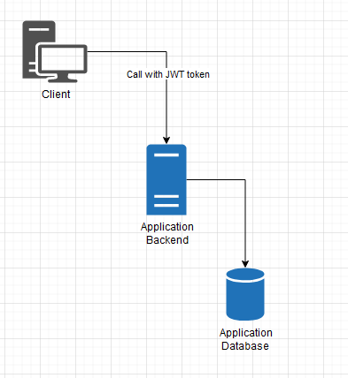
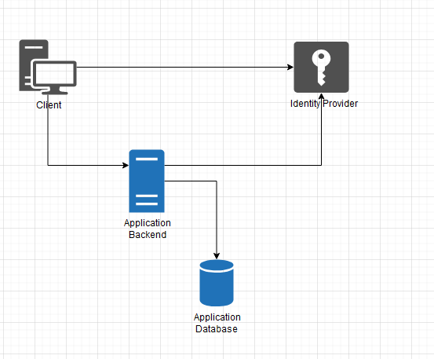

# Monolith

## Monolith Artictecture 

### With JWT



### With identity provider



## Monolith structure 

```
AppFolder
├───docker -> all docker related files
├───src
│   ├───MyApp
│   │   └───ClientApp -> all client related files 
│   │       ├───src
│   │       ├───test
│   │       └───webpack
│   ├───MyApp.Crosscuting
│   ├───MyApp.Domain
│   ├───MyApp.Domain.Services
│   ├───MyApp.Dto
│   └───MyApp.Infrastructure
└───tests -> Server tests
```