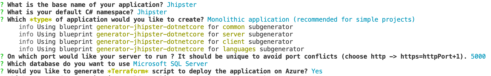

# Azure

## Deploy using Terraform
Currently supports only monolithic app with SQL Server as database (support for other databases are WIP). Terraform scripts will create Azure App Service, Azure SQL Server

### Prerequisites
1. [Docker](https://www.docker.com/products/docker-desktop) installed with docker-compose and have push access to any of the docker repository like docker hub or Azure container registry.
2. [Azure CLI](https://docs.microsoft.com/fr-fr/cli/azure/install-azure-cli) installed on your system. Terraform will require it to authenticate in Azure subscription. 
3. [Terraform CLI](https://www.terraform.io/downloads.html) installed on your system.

### Steps to follow
1. Execute generate app command and select app as Monolithic with Microsoft SQL server as database. Select **yes** to generate Terraform scripts. (_default:_ is _No_)


2. Use docker-compose command to first build the docker image.
```bash
docker-compose -f docker/app.yml build
```
3. Tag the image built during the previous step to push to docker repository by using
```bash
docker tag <source-image> <destination-image>:version/tag
```
4. Push the image to docker hub or any docker service provider by using
```bash
docker push <destination-image>:version/tag
```
_Note:_ The docker image link and its tag will use as input to Terraform variables.
5. In the generated app folder, change directory to the Terraform folder.
```bash
cd terraform
```
6. Login into your Azure CLI by using
```bash
az login
```
_Note:_ Terraform plan command will work only if the user is authenticated using Azure CLI.

7. Create a file (_**terraform.tfvars**_) in the Terraform folder to provide input to the Terraform main script using below content:
```
location                = "Central US"
subscription_id         = "<your-azure-subscription>"
mssql_admin_user        = "dbUser"
mssql_admin_password    = "Password!12"
docker_image            = "a5ingh/jhipster-dotnetcore-sampleapp"
docker_image_tag        = "0.1"
```

8. Execute below terraform commands (one by one) to create resources (Azure app service, Azure SQL) and deploy as a docker image to app service:
    1. `terraform init` # to initialize terraform.
    1. `terraform plan -out "MyAppPlan"` # can choose any name instead of MyAppPlan.
    1. `terraform apply "MyAppPlan"` # it will create the resources and then provide you the link to your deployed app as output variable.

9. You can use `terraform destroy` to delete/remove all the created resources once you are done using it.
