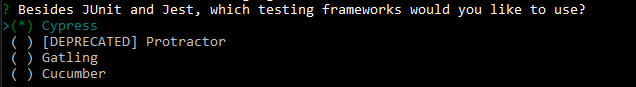

# Cypress

When generating an application, you are able to automatically generate Cypress tests.

## Introduction

Cypress is a next generation front end testing tool built for the modern web. It allows to run multiple end to end tests on all your application features.

## Pre-requisites

When generating your application, make sure to check "Cypress" in your optional testing framworks (by pressing the space bar).



## How to use it

Once your application is generated, you can optionally add some entities, it will automatically generate the corresponding tests for your entities. To begin, go to your ClientApp folder:

```bash
cd src/YourApplication/ClientApp
```

Then execute one of the following commands:

```bash
npx cypress open
```

or

```bash
./node_modules/.bin/cypress open
```

For futher information you can visit [Cypress wiki](https://docs.cypress.io/guides/guides/command-line#How-to-run-commands).
