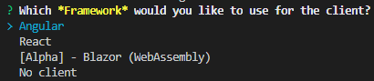
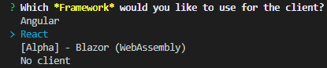
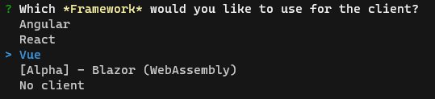
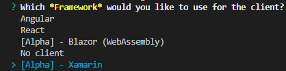
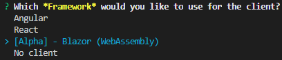

# Fronts

When generating an application, you are able to choose between multiple fronts. 

## Angular

Angular (commonly referred to as "Angular 2+" or "Angular v2 and above") is a TypeScript-based open-source web application framework.

### Generate your application

Call the generator

```bash
jhipster --blueprints dotnetcore
```

and choose Angular



For further information: [Using Angular with JHipster](https://www.jhipster.tech/using-angular/)

## React

React (also known as React.js or ReactJS) is an open-source, front end, JavaScript library for building user interfaces or UI components.

### Generate your application

Call the generator

```bash
jhipster --blueprints dotnetcore
```

and choose React



For further information: [Using React with JHipster](https://www.jhipster.tech/using-react/)

## Vue.js

Vue.js is a progressive, incrementally-adoptable JavaScript framework for building UI on the web.

### Generate your application

Call the generator

```bash
jhipster --blueprints dotnetcore
```

and choose Vue



For further information: [Using Vue with JHipster](https://www.jhipster.tech/using-vue/)

## Alpha - Xamarin

With a C#-shared codebase, developers can use Xamarin tools to write native Android, iOS, and Windows apps with native user interfaces and share code across multiple platforms, including Windows, macOS, and Linux.

### Available features

- Handle registration and connection.
- Sidebar menu to navigate through pages.
- Entities and users management.
- Auto-generated entity models, services, views and viewmodels.

### NuGet requirements

- [akavache](https://www.nuget.org/packages/akavache/) >= 7.1.1
- [MvvmCross.Forms](https://www.nuget.org/packages/MvvmCross.Forms/) >= 7.1.1
- [System.ComponentModel.Annotations](https://www.nuget.org/packages/System.ComponentModel.Annotations/) >= 5.0.0
- [System.Net.Http.Json](https://www.nuget.org/packages/System.Net.Http.Json/) >= 3.2.1
- [Xamarin.Forms](https://www.nuget.org/packages/Xamarin.Forms) >= 4.6.0
- [Xamarin.Essential](https://www.nuget.org/packages/Xamarin.Essentials/) >=1.5.3

### Why Xamarin

Xamarin allows to take advantage of this blueprint. Indeed, it enables to generate a modern cross platform application with both front-end and back-end in C#.

### Generate your application 

Call the generator

```bash
jhipster --blueprints dotnetcore
```

and choose Xamarin



### Structure

Any generated Xamarin application is structured as follows
```
client
├── Namespace.Client.Xamarin.Core     - Your core application
│   ├── Models
│   │   ├── Entities                  - Generated models
│   ├── Services
│   │   ├── Entities                  - Generated services
│   ├── ViewModels
│   │   ├── Entities                  - Generated viewmodels
│   ├── Views
│   │   ├── Entities                  - Generated views
├── Namespace.Client.Xamarin.Android  - Your Android application
│   ├── Resources          
│   │   ├── drawable                  - Contains your images
│   │   ├── Layout                    - Contains your layouts
│   ├── Properties
├── Namespace.Client.Xamarin.iOS      - Your iOS application   
│   ├── Resources                     - Contains your images
│   ├── Properties
├── Namespace.Client.Xamarin.Shared   - Shared code
│   ├── Constants                     - Contains shared constants
```

### Limitations 

For the moment, the Xamarin generation has certain limitations : 

- No Offline mode
- No User managment
- No validation on entity fields
- No translation 
- No Tests
- Only JWT security is implemented 

## Alpha - Blazor

Blazor is a free and open-source web framework that enables developers to create web apps using C# and HTML.

### Why Blazor ? 

Blazor can run your client-side C# code directly in the browser, using WebAssembly. Because it's real .NET running on WebAssembly, you can re-use code and libraries from server-side parts of your application. (https://dotnet.microsoft.com/apps/aspnet/web-apps/blazor)

### Prerequisites

- [dotnet5.0](https://dotnet.microsoft.com/download/dotnet/5.0)

### Generate your application 

Call the generator

```bash
jhipster --blueprints dotnetcore
```

and choose Blazor (WebAssembly)



After that, your application is ready, and you can now use it with default user (admin admin or user user)

#### Start your application

##### Run the Backend

```bash
dotnet run --verbosity normal --project ./src/YourAppName/YourAppName.csproj
```

##### Run the Frontend

```bash
dotnet run --verbosity normal --project ./src/client/YourAppName.Client/YourAppName.Client.csproj
```

#### Start your application with Hot Reload

##### Run the Backend
```bash
 dotnet watch --project ./src/YourAppName/YourAppName.csproj run --verbosity normal
 ```
##### Run the Frontend
```bash
 dotnet watch --project ./src/client/YourAppName.Client/YourAppName.Client.csproj run --verbosity normal
 ```

### Generate entities 

Like the others front technologies you can generate entities for Blazor.

#### With CLI
```bash
jhipster entity <entity-name>
```

#### With [JDL](https://start.jhipster.tech/jdl-studio/)
```bash
jhipster import-jdl my_file.jdl
```

### Tools 

As the project used SASS, to install and consume SCSS third parties libraries like Bootstrap we use Microsoft Library Manager (aka [libman](https://github.com/aspnet/LibraryManager)) 
You can find libman configuration in the same directory than the client solution (./src/client/YourAppName.Client)

To minify CSS we use Excubo.WebCompiler (aka [webcompiler](https://github.com/excubo-ag/WebCompiler))

These two tools are installed during JHipster client generation, and you can find the execution in Client.csproj (./src/client/YourAppName.Client/YourAppName.Client.csproj)

### UI components 

To speed up our development we use [Blazored](https://github.com/Blazored) components like Blazored.Modal or Blazored.SessionStorage. 

We also use [Blazorise](https://github.com/stsrki/Blazorise) which has really interesting components.

### UT 

For unit test we use the awesome library [bUnit](https://github.com/egil/bUnit).

You can find client unit test in ./test/YourAppName.Client.Test

### Limitations 

For the moment, the Blazor generation has certain limitations : 

- Only support DTO you can't use application without DTO 
- No validation on entity fields (The validation is only on user management part)
- No translation 
- Only JWT security is implemented 
