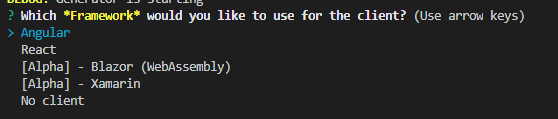

# Fronts

When generating an application, you are able to choose between multiple fronts. 


## Angular

Angular (commonly referred to as "Angular 2+" or "Angular v2 and above") is a TypeScript-based open-source web application framework.

## React

React (also known as React.js or ReactJS) is an open-source, front end, JavaScript library for building user interfaces or UI components.

## Alpha - Blazor

Blazor is a free and open-source web framework that enables developers to create web apps using C# and HTML.

## Alpha - Xamarin

With a C#-shared codebase, developers can use Xamarin tools to write native Android, iOS, and Windows apps with native user interfaces and share code across multiple platforms, including Windows, macOS, and Linux.

### Available features

- Handle registration and connection.
- Sidebar menu to navigate through pages.
- Entities and users management.
- Auto-generated entity models, services, views and viewmodels.

### NuGet requirements

- [akavache](https://www.nuget.org/packages/akavache/) >= 7.1.1
- [MvvmCross.Forms](https://www.nuget.org/packages/MvvmCross.Forms/) >= 7.1.1
- [System.ComponentModel.Annotations](https://www.nuget.org/packages/System.ComponentModel.Annotations/) >= 5.0.0
- [System.Net.Http.Json](https://www.nuget.org/packages/System.Net.Http.Json/) >= 3.2.1
- [Xamarin.Forms](https://www.nuget.org/packages/Xamarin.Forms) >= 4.6.0
- [Xamarin.Essential](https://www.nuget.org/packages/Xamarin.Essentials/) >=1.5.3

### Why Xamarin

Xamarin allows to take advantage of this blueprint. Indeed, it enables to generate a modern cross platform application with both front-end and back-end in C#.

### Structure

Any generated Xamarin application is structured as follows
```
client
├── Namespace.Client.Xamarin.Core     - Your core application
│   ├── Models
│   │   ├── Entities                  - Generated models
│   ├── Services
│   │   ├── Entities                  - Generated services
│   ├── ViewModels
│   │   ├── Entities                  - Generated viewmodels
│   ├── Views
│   │   ├── Entities                  - Generated views
├── Namespace.Client.Xamarin.Android  - Your Android application
│   ├── Resources          
│   │   ├── drawable                  - Contains your images
│   │   ├── Layout                    - Contains your layouts
│   ├── Properties
├── Namespace.Client.Xamarin.iOS      - Your iOS application   
│   ├── Resources                     - Contains your images
│   ├── Properties
├── Namespace.Client.Xamarin.Shared   - Shared code
│   ├── Constants                     - Contains shared constants
```