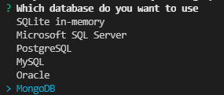

# MongoDB

When generating an application, you can choose to use a NoSQL Database thanks to MongoDB.

## Introduction

[MongoDB](https://www.mongodb.com/) is a document-oriented NoSQL database used for high volume data storage. Instead of using tables and rows as in the traditional relational databases, MongoDB makes use of collections and documents.

## Pre-requisites

When generating your application, make sure to choose "MongoDB" as your database.



## Difference with SQL databases

The main difference with the other SQL databases is that your IDs are handled as string and are stored in ObjectID instead of long.

Also, some classes are replaced in order to support MongoDB :
```
BaseEntity => MongoBaseEntity
GenericRepository => MongoGenericRepository
ReadOnlyGenericRepository => MongoReadOnlyGenericRepository
FluentRepository => NoSqlFluentRepository
```

## WIP

Currently, MongoDB is only used for entities. Users/Accounts are managed with a in-memory Sqlite. This feature is still under development.